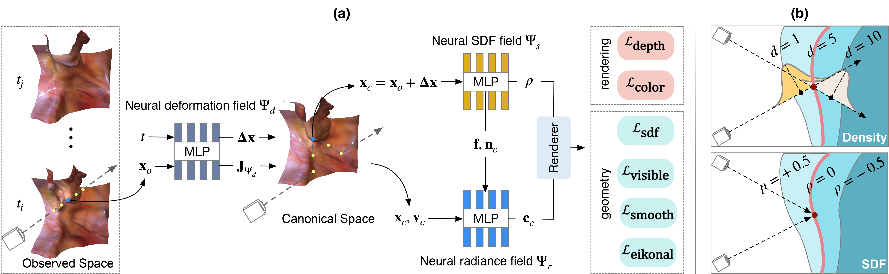

# EndoSurf: Neural Surface Reconstruction of Deformable Tissues with Stereo Endoscope Videos

### [Paper](https://arxiv.org/abs/2307.11307) | [Models](https://drive.google.com/drive/folders/1PdrdrUB_v21ygvS4An8WGd4cprsq92Ps?usp=sharing)

Code for MICCAI 2023 paper *EndoSurf: Neural Surface Reconstruction of Deformable Tissues with Stereo Endoscope Videos* by [Ruyi Zha](https://ruyi-zha.github.io/), [Xuelian Cheng](https://xueliancheng.github.io/), [Hongdong Li](http://users.cecs.anu.edu.au/~hongdong/), [Mehrtash Harandi](https://sites.google.com/site/mehrtashharandi/home) and [Zongyuan Ge](https://zongyuange.github.io/).

EndoSurf is a neural-field-based method that reconstructs the deforming surgical sites with stereo endoscope videos.



## Demo

|                       EndoSurf (Ours)                        |                     EndoNeRF (baseline)                      |
| :----------------------------------------------------------: | :----------------------------------------------------------: |
|  |  |
|  |  |

## Setup

We recommond using Miniconda to set up the environment.

```sh
# Create conda environment
conda create -n endosurf python=3.9
conda activate endosurf

# Install packages
pip install torch==1.11.0+cu113 torchvision==0.12.0+cu113 --extra-index-url https://download.pytorch.org/whl/cu113
pip install -r requirements.txt
```

## Dataset and checkpoints

* Follow [this instruction](data/endonerf/README.md) to prepare ENDONERF dataset.
* Follow [this instruction](data/scared2019/README.md) to prepare SCARED2019 dataset.
* Follow [this instruction](logs/README.md) to download checkpoints.


## Training

Use `src/trainer/trainer_endosurf.py` for training. You can find all configurations in `configs/endosurf` and training commands in `scripts.sh`. 

``` sh
# Train EndoSurf on pulling_soft_tissues
CUDA_VISIBLE_DEVICES=0 python src/trainer/trainer_endosurf.py --cfg configs/endosurf/baseline/base_pull.yml --mode train
# Train EndoSurf on cutting_tissues_twice
CUDA_VISIBLE_DEVICES=0 python src/trainer/trainer_endosurf.py --cfg configs/endosurf/baseline/base_cut.yml --mode train
# Train EndoSurf on scared2019_dataset_1_keyframe_1
CUDA_VISIBLE_DEVICES=0 python src/trainer/trainer_endosurf.py --cfg configs/endosurf/baseline/base_d1k1.yml --mode train
# Train EndoSurf on scared2019_dataset_2_keyframe_1
CUDA_VISIBLE_DEVICES=0 python src/trainer/trainer_endosurf.py --cfg configs/endosurf/baseline/base_d2k1.yml --mode train
# Train EndoSurf on scared2019_dataset_3_keyframe_1
CUDA_VISIBLE_DEVICES=0 python src/trainer/trainer_endosurf.py --cfg configs/endosurf/baseline/base_d3k1.yml --mode train
# Train EndoSurf on scared2019_dataset_6_keyframe_1
CUDA_VISIBLE_DEVICES=0 python src/trainer/trainer_endosurf.py --cfg configs/endosurf/baseline/base_d6k1.yml --mode train
# Train EndoSurf on scared2019_dataset_7_keyframe_1
CUDA_VISIBLE_DEVICES=0 python src/trainer/trainer_endosurf.py --cfg configs/endosurf/baseline/base_d7k1.yml --mode train
```

## Test

After training, run `src/trainer/trainer_endosurf.py` with `test` mode to evaluate reconstruction results on the test set. You can test 2D images with `--mode test_2d`, 3D meshes with `--mode test_3d`, or both results with `--mode test`. Example of testing EndoSurf on case `pulling_soft_tissues` is:

```sh
# Evaluate all results
CUDA_VISIBLE_DEVICES=0 python src/trainer/trainer_endosurf.py \
    --cfg configs/endosurf/baseline/base_pull.yml --mode test

# Evaluate 2D images only
CUDA_VISIBLE_DEVICES=0 python src/trainer/trainer_endosurf.py \
    --cfg configs/endosurf/baseline/base_pull.yml --mode test_2d

# Evaluate 3D meshes only
CUDA_VISIBLE_DEVICES=0 python src/trainer/trainer_endosurf.py \
    --cfg configs/endosurf/baseline/base_pull.yml --mode test_3d
```

You can also generate reconstruction results of all video frames with `--mode demo`.

```sh
# Demonstrate all results
CUDA_VISIBLE_DEVICES=0 python src/trainer/trainer_endosurf.py \
    --cfg configs/endosurf/baseline/base_pull.yml --mode demo

# Demonstrate 2D images only
CUDA_VISIBLE_DEVICES=0 python src/trainer/trainer_endosurf.py \
    --cfg configs/endosurf/baseline/base_pull.yml --mode demo_2d

# Demonstrate 3D meshes only
CUDA_VISIBLE_DEVICES=0 python src/trainer/trainer_endosurf.py \
    --cfg configs/endosurf/baseline/base_pull.yml --mode demo_3d
```

## Reproducing results in the paper 

To reproduce all results shown in the paper, first download data information files `*.pkl` from [here](https://drive.google.com/drive/folders/1CjmYmGxIWh7DRE14tSorL9-tAQsHVLTt?usp=sharing) and replace the previous files in `data/data_info`. This is because `preprocess.py` invovles some random operations e.g., point cloud noise removal. Then download the pretrained models from [here](logs/README.md). You can find all training/test/demo commands for our method, baseline methods and ablation study from `scripts.sh`.


### Contact
For any queries, please contact **ruyi.zha@anu.edu.au**.