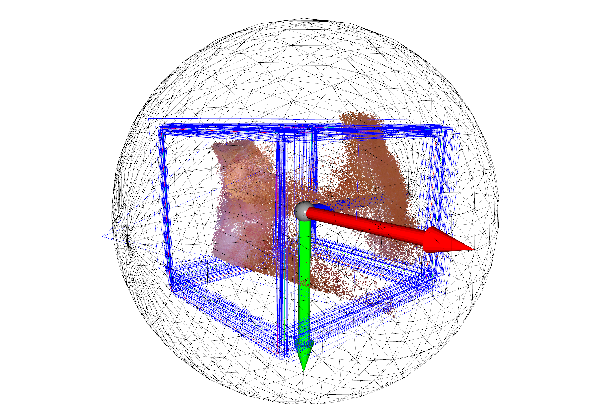

# Download and preprocess ENDONERF dataset

Download [ENDONERF dataset](https://github.com/med-air/EndoNeRF). Put or link two sample cases `cutting_tissues_twice` and `pulling_soft_tissues` into `data/endonerf/dataset` folder. `data/endonerf/dataset` should be as organized in the following structure.

``` sh
├── data
│   ├── endonerf
│   │   ├── dataset
│   │   │   ├── cutting_tissues_twice
│   │   │   │   ├── ...
│   │   │   ├── pulling_soft_tissues
│   │   │   │   ├── ...
│   │   ├── ...
```

Preprocess the dataset with `data/endonerf/preprocess.py`. It scales and transforms the scene into a unit sphere, similar to [NeuS](https://github.com/Totoro97/NeuS/tree/main/preprocess_custom_data). A `*.pkl` file is also generated in `data/data_info/endonerf` to save all information about the dataset. Add `--show` to visualize results.

``` sh
python data/endonerf/preprocess.py --dset_dir data/endonerf/dataset/pulling_soft_tissues  # --show
python data/endonerf/preprocess.py --dset_dir data/endonerf/dataset/cutting_tissues_twice  # --show
```

You can also [download](https://drive.google.com/drive/folders/1qM5RCU7rtPb8rXfgeeKb7n3nULINXBBu?usp=sharing) the preprocessed `*.pkl` files which are used in original paper.

Example preprocessing is shown below.



The overall data directory should be organized in the following structure.

``` sh
├── data
│   ├── data_info
│   │   ├── endonerf
│   │   │   ├── cutting_tissues_twice.pkl
│   │   │   ├── pulling_soft_tissues.pkl
│   ├── endonerf
│   │   ├── dataset
│   │   │   ├── cutting_tissues_twice
│   │   │   │   ├── ...
│   │   │   ├── pulling_soft_tissues
│   │   │   │   ├── ...
│   │   ├── ...
│   ├── ...
```
