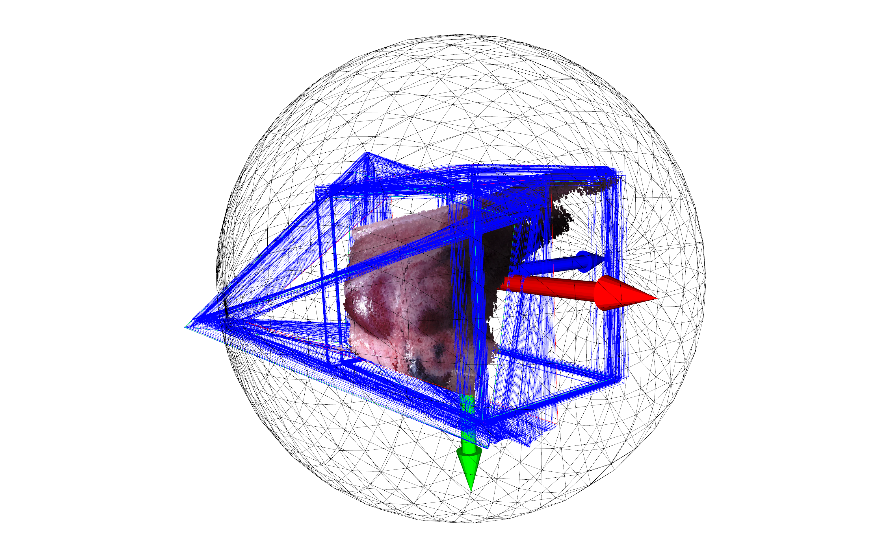

# Download and preprocess SCARED dataset

Download [SCARED dataset](https://endovissub2019-scared.grand-challenge.org/Home/). To obtain a link to the data and code release, sign the challenge rules and email them to `max.allan@intusurg.com`. You will receive a temporary link to download the data and code.

Follow [MICCAI_challenge_preprocess](https://github.com/EikoLoki/MICCAI_challenge_preprocess) to extract data. Put or link folders of the following cases into `data/scared2019/dataset` folder.

* dataset_1_keyframe_1
* dataset_2_keyframe_1
* dataset_3_keyframe_1
* dataset_6_keyframe_1
* dataset_7_keyframe_1

`data/scared2019/dataset` should be as organized in the following structure.

```sh
├── data
│   ├── scared2019
│   │   ├── dataset
│   │   │   ├── dataset_1_keyframe_1
│   │   │   │   ├── data
│   │   │   │   │   ├── disparity
│   │   │   │   │   ├── frame_data
│   │   │   │   │   ├── left_finalpass
│   │   │   │   │   ├── reprojection_data
│   │   │   │   │   ├── ...
│   │   │   │   ├── ...
│   │   │   ├── dataset_2_keyframe_1
│   │   │   │   ├── ...
│   │   │   ├── dataset_3_keyframe_1
│   │   │   │   ├── ...
│   │   │   ├── dataset_6_keyframe_1
│   │   │   │   ├── ...
│   │   │   ├── dataset_7_keyframe_1
│   │   │   │   ├── ...
│   │   ├── ...
```

Preprocess the dataset with `data/scared2019/preprocess.py`. It scales and transforms the scene into a unit sphere, similar to [NeuS](https://github.com/Totoro97/NeuS/tree/main/preprocess_custom_data). It also produces masks based on the validation area of depth maps (results saved in `data/scared2019/dataset/*/data_processed`). A `*.pkl` file is also generated in `data/data_info/scared2019` to save all information about the dataset. Add `--show` to visualize results.

```sh
python data/scared2019/preprocess.py --dset_dir data/scared2019/dataset/dataset_1_keyframe_1  --skip_every 2  # --show
python data/scared2019/preprocess.py --dset_dir data/scared2019/dataset/dataset_2_keyframe_1  --skip_every 1  # --show
python data/scared2019/preprocess.py --dset_dir data/scared2019/dataset/dataset_3_keyframe_1  --skip_every 4 # --show
python data/scared2019/preprocess.py --dset_dir data/scared2019/dataset/dataset_6_keyframe_1  --skip_every 8  # --show
python data/scared2019/preprocess.py --dset_dir data/scared2019/dataset/dataset_7_keyframe_1  --skip_every 8  # --show
```

You can also [download](https://drive.google.com/drive/folders/1Nt5H9TxVnQBH1JdTITmk7zSiUmaQ3wPB?usp=sharing) the preprocessed `*.pkl` files which are used in original paper.

Example preprocessing is shown below.



The overall data directory should be organized in the following structure.

```sh
├── data
│   ├── data_info
│   │   ├── scared2019
│   │   │   ├── dataset_1_keyframe_1.pkl
│   │   │   ├── dataset_2_keyframe_1.pkl
│   │   │   ├── dataset_3_keyframe_1.pkl
│   │   │   ├── dataset_6_keyframe_1.pkl
│   │   │   ├── dataset_7_keyframe_1.pkl
│   ├── scared2019
│   │   ├── dataset
│   │   │   ├── dataset_1_keyframe_1
│   │   │   │   ├── data_processed
│   │   │   │   │   ├── ...
│   │   │   │   ├── ...
│   │   │   ├── dataset_2_keyframe_1
│   │   │   │   ├── ...
│   │   │   ├── dataset_3_keyframe_1
│   │   │   │   ├── ...
│   │   │   ├── dataset_6_keyframe_1
│   │   │   │   ├── ...
│   │   │   ├── dataset_7_keyframe_1
│   │   │   │   ├── ...
│   │   ├── ...
│   ├── ...
```
